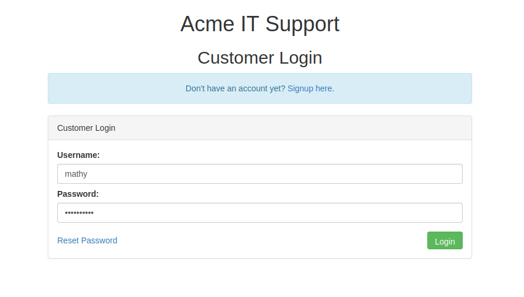
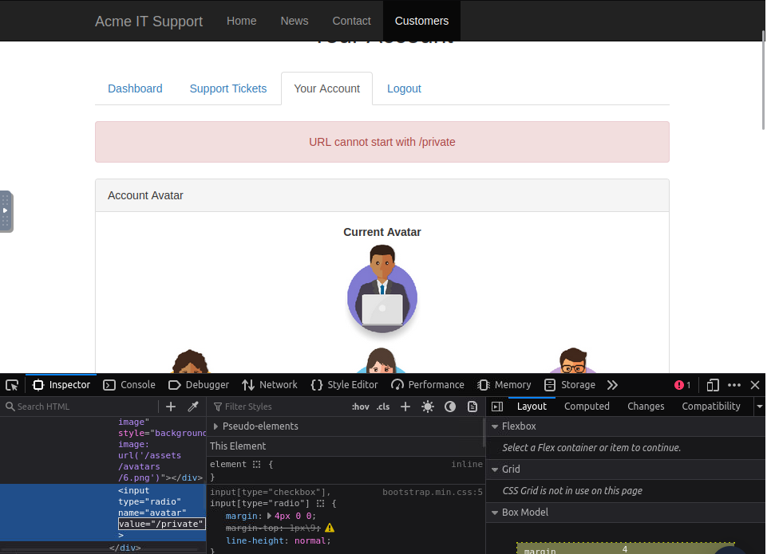
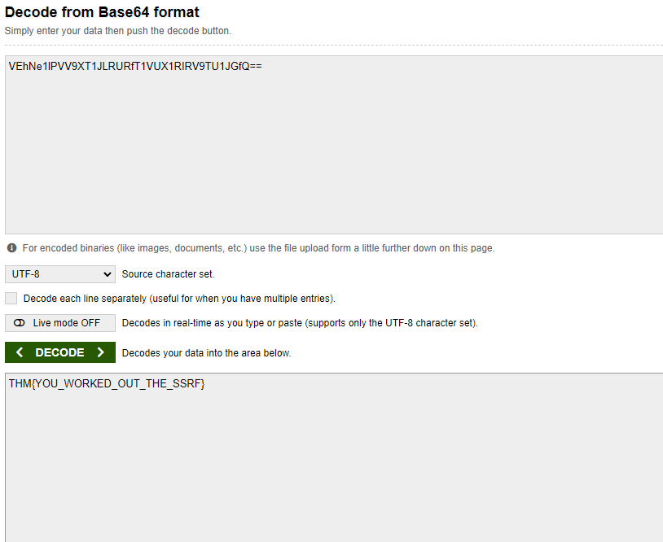

DAY 1: Exploring SSRF
Date: 2024-06-04
Room: Intro to Server Side Request Forgery (SSRF) @TryHackMe

Objective:
Find the flag in the /private directory.

Steps Taken:

Account Creation:
Created a new account on the ACME IT Support website. This was necessary to gain access to the /customers/new-account-page where the SSRF vulnerability could be exploited.

Identifying the Vulnerability:
On the new account page, I found an option to choose an avatar. Each avatar choice was represented by a radio button with a value pointing to different image assets, such as /image/assetX.

Initial Attempt:
I first attempted to change the value of the avatar selection to /private, hoping it would grant access to the directory. However, this resulted in an error message: "URL cannot start with private."

Bypassing the Restriction:
To bypass this restriction, I applied a directory traversal technique. I modified the value to x/../private. This trick essentially moved one directory up and then accessed the /private directory.
This adjustment successfully bypassed the block, allowing me to retrieve the flag needed to complete the room. 

I also need to decode the base64 value. 

You can find the flag in the flag.txt file for easy access. 

What I Learned:
Directory Traversal Basics:
I learned how directory traversal can be used to bypass access controls by manipulating file paths. This involves using special sequences like ../ to navigate through the file system, 
potentially accessing sensitive directories or files.

Reflection:

Security Implications:

Understanding directory traversal is crucial for both attacking and defending web applications. This exercise highlighted the importance of validating and sanitizing user inputs to prevent unauthorized access.
I realized that even a seemingly minor oversight in input validation could lead to significant security breaches, emphasizing the need for rigorous testing and secure coding practices.

SSRF Context:
This exercise was also an introduction to SSRF, where the server is tricked into making requests to internal or external resources. It's a powerful vulnerability that, if left unchecked, 
can lead to data leaks, internal network scanning, and further exploits.

Practical Application:
By engaging in hands-on practice through TryHackMe, I gained a better understanding of the concepts and their practical applications. 
